# 🌊 Signature Verification Workflow

> [!NOTE]
> This document visualizes the end-to-end flow of the `final.ipynb` notebook, from data ingestion to model fine-tuning.

---

## 🚀 1. Project Initialization & Setup
**Goal**: Prepare the environment and define constants for reproducibility.

*   **📚 Libraries**: `TensorFlow`, `NumPy`, `Matplotlib`, `Seaborn`, `Sklearn`.
*   **⚙️ Configuration**:
    *   `SEED = 42` (Reproducibility)
    *   `IMG_SIZE = (224, 224)`
    *   `BATCH_SIZE = 32`

---

## 📂 2. Data Pipeline

The data goes through a rigorous preparation process to ensure clean training, validation, and testing sets.

```mermaid
graph TD
    A[📂 Raw Dataset<br>DataSet/signatures] -->|Read & Filter| B(dataset_prep Function)
    B -->|Split Logic| C{Split Type}
    C -->|Train| D[📂 Train<br>DataSet/processed_data/train]
    C -->|Validation| E[📂 Val<br>DataSet/processed_data/val]
    C -->|Test| F[📂 Test<br>DataSet/processed_data/test]
    
    D --> G(tf.keras.utils.image_dataset_from_directory)
    E --> G
    F --> G
    
    G --> H[📦 Batched & Prefetched Datasets]
    
    subgraph Augmentation [🖼️ Data Augmentation Layer]
        H --> I(RandomRotation 0.15)
        I --> J(RandomZoom 0.15)
        J --> K(RandomTranslation 0.1)
        K --> L(RandomContrast 0.2)
    end
    
    L --> M[Ready for Training]
    
    style A fill:#ffcc00,stroke:#333,stroke-width:2px
    style M fill:#00cc66,stroke:#333,stroke-width:2px
```

---

## 🧠 3. Model Architectures

We explore two distinct architectures to solve the verification problem.

### A. Improved Custom CNN
A deeper Convolutional Neural Network built from scratch.

### B. Transfer Learning with MobileNetV2
Leveraging a pre-trained powerhouse for feature extraction.

```mermaid
graph LR
    Input[Input 224x224x3] --> Aug[Data Augmentation]
    Aug --> Pre[MobileNet Preprocess]
    Pre --> MobileNet[📱 MobileNetV2<br>Weights: Imagenet<br>Include Top: False]
    MobileNet --> Pool[Global Avg Pooling]
    Pool --> BN[Batch Norm]
    BN --> Head[Custom Dense Head<br>256 -> 128 -> 1]
    Head --> Output[Sigmoid Output]

    style MobileNet fill:#e1bee7,stroke:#4a148c,stroke-width:2px
```

---

## ⚙️ 4. Training Strategy

The notebook employs a multi-phase training approach to maximize performance.

---

## 📊 5. Metrics & Evaluation
The models are evaluated using a suite of metrics to ensure robustness against forgeries.

*   **Accuracy**: Overall correctness.
*   **Precision**: Ability to avoid false positives (calling a forgery genuine).
*   **Recall**: Ability to catch all genuine signatures.
*   **AUC (Area Under Curve)**: Performance aggregate across threshold settings.
