# 👯 Siamese Network Workflow

> [!NOTE]
> This document visualizes the end-to-end flow of the `siamese_final.ipynb` notebook, specifically designed for one-shot signature verification.

---

## 🚀 1. Project Initialization
**Goal**: Set up the environment for pair-based learning.

*   **⚙️ Constants**:
    *   `IMG_SIZE = (224, 224)`
    *   `BATCH_SIZE = 32`
*   **📂 Root Directory**: `DataSet/processed_data` (Uses the data split by the main notebook).

---

## 📂 2. Siamese Data Pipeline

Unlike traditional classification, this pipeline generates *pairs* of images to learn similarity.

```mermaid
graph TD
    A[📂 Processed Data] --> B(make_pairs Function)
    
    subgraph Pair Generation Logic
        B --> C{Pair Type?}
        C -->|Genuine + Genuine| D[✅ Positive Pair<br>Label: 1]
        C -->|Genuine + Forged| E[❌ Negative Pair<br>Label: 0]
    end
    
    D --> F[Raw List of Pairs & Labels]
    E --> F
    
    F --> G(make_tf_dataset)
    G --> H{Map Function}
    H --> I[Load Image 1]
    H --> J[Load Image 2]
    
    I --> K[Resize & Cast]
    J --> K
    
    K --> L[⚡ Batched & Prefetched Pairs]
    
    style D fill:#dcedc8,stroke:#33691e
    style E fill:#ffcdd2,stroke:#b71c1c
```

---

## 🧠 3. Network Architecture

The architecture consists of twin networks sharing exact weight copies.

### A. Embedding Network (Feature Extractor)
Transforms a raw image into a dense vector (embedding).

```mermaid
graph LR
    Input[Input 224x224x3] --> Pre[MobileNet Preprocess]
    Pre --> Mob[📱 MobileNetV2<br>Frozen Backbone]
    Mob --> Pool[Global Avg Pooling]
    Pool --> Dense[Dense 128]
    Dense --> BN[Batch Normalization]
    BN --> Out[Embedding Vector]
    
    style Mob fill:#e1bee7,stroke:#4a148c
```

### B. Siamese & Distance Calculation
Computes the similarity between two embeddings.

---

## ⚙️ 4. Training Strategy

*   **Optimizer**: `Adam(learning_rate=1e-4)`
*   **Loss Function**: `Contrastive Loss`
    *   Pulls positive pairs closer ($Distance \to 0$)
    *   Pushes negative pairs apart ($Distance > Margin$)
*   **Callbacks**: `EarlyStopping` (Monitors validation loss).

---

## 👁️ 5. Verification & Inference

Making decisions based on the calculated distance.

